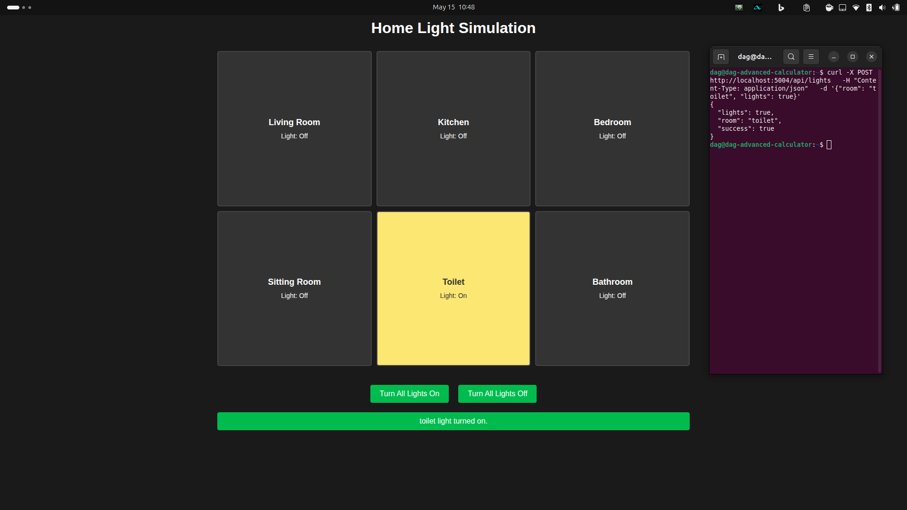
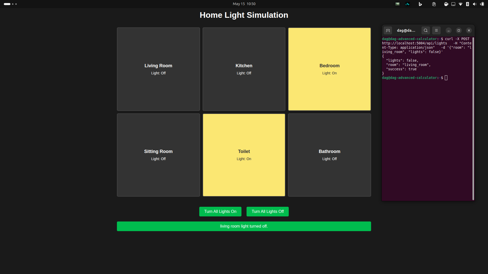
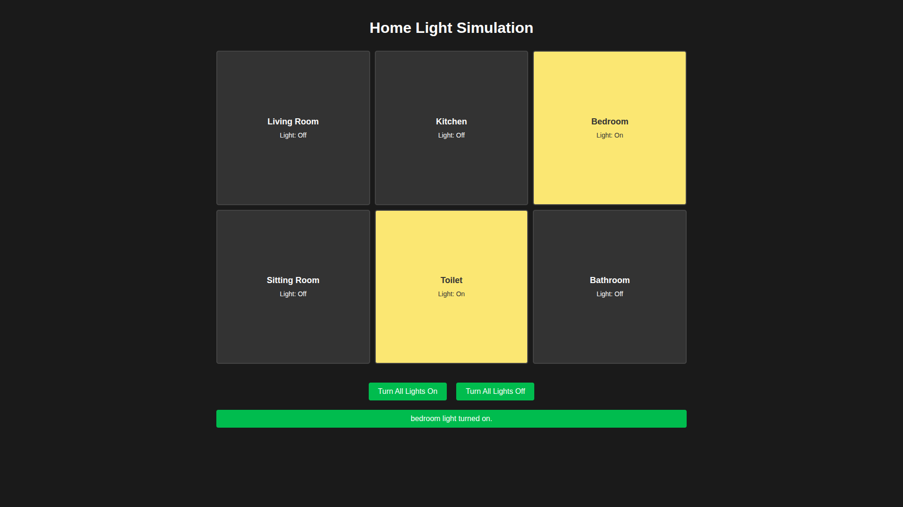

# Home Light Simulation

This application is a web simulation used to control the lights of rooms in a house. It runs in the background using Flask and provides an API to turn the room lights on and off.

## Features

- 6 different rooms (living room, sitting room, kitchen, toilet, bathroom, bedroom)
- Light control for each room
- Buttons to turn all lights on/off
- Light control with REST API

## Installation

1. Install the requirements:
   ```
   pip install -r requirements.txt
   ```

2. Run the application:
   ```
   python app.py
   ```

3. Access from your browser at `http://localhost:5004`

## API Usage

You can use the following API to control the lights:

```
POST /api/lights
Content-Type: application/json

{
  "room": "room_name",
  "lights": true/false
}
```

Example:
```
{
  "room": "toilet",
  "lights": true
}
```

### API Usage Examples with Curl:

To turn on the toilet light:
```bash
curl -X POST http://localhost:5004/api/lights \
  -H "Content-Type: application/json" \
  -d '{"room": "toilet", "lights": true}'
```

To turn off the living room light:
```bash
curl -X POST http://localhost:5004/api/lights \
  -H "Content-Type: application/json" \
  -d '{"room": "living room", "lights": false}'
```

## To get all room states:

```
GET /api/get_states
```

To get all room states using curl:
```bash
curl -X GET http://localhost:5004/api/get_states
```

## Real-Time Updates

This application uses WebSocket (socket.io) to show changes made via the API in real-time on the web interface. Each update made via the API is automatically reflected on the web interface without the need to refresh the page.

## Screenshots

Here are some screenshots of the application:

### Home Interface Overview


### Living Room Light On


### Bedroom Light On

